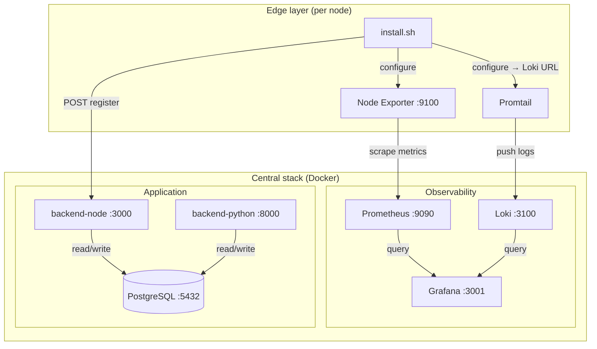
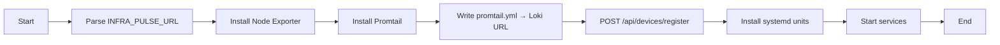

# Phase 1: Infrastructure & Observability Foundation

This document describes the InfraPulse Phase 1 deliverables: Docker Compose stack, observability configuration, and edge-node install script, with detailed component relationships and connection diagrams.

---

## 1. Overview and Goals

| Goal | Description |
|------|-------------|
| **Containerized stack** | Single `docker-compose.yml` bringing up PostgreSQL, Prometheus, Loki, Grafana, and placeholder Node.js and Python backends. |
| **Observability config** | Prometheus scraping itself and edge nodes (file-based discovery); Loki configured for log ingestion and retention. |
| **Edge enrollment** | Bash script `scripts/install.sh` installs Node Exporter and Promtail on edge nodes, configures them toward the central server, and registers the node via the Node.js API. |

---

## 2. Component Summary

| Component | Image / Source | Container name | Role |
|-----------|----------------|----------------|------|
| **PostgreSQL** | `postgres:16-alpine` | `infrapulse-postgres` | Metadata, device roster, alerts (Phase 2+). |
| **Prometheus** | `prom/prometheus:v2.47.2` | `infrapulse-prometheus` | Scrape and store metrics (self + edge Node Exporters). |
| **Loki** | `grafana/loki:2.9.2` | `infrapulse-loki` | Ingest and store logs from Promtail. |
| **Grafana** | `grafana/grafana:10.2.2` | `infrapulse-grafana` | Dashboards and query UI for Prometheus/Loki. |
| **backend-node** | `node:20-alpine` (placeholder) | `infrapulse-backend-node` | API and device management (Phase 2); placeholder HTTP in Phase 1. |
| **backend-python** | `python:3.11-slim` (placeholder) | `infrapulse-backend-python` | AI engine and predictive alerts (Phase 3); placeholder HTTP in Phase 1. |

---

## 3. Ports and Defaults

| Service | Internal port | Host port (default) | Env override |
|---------|----------------|----------------------|--------------|
| PostgreSQL | 5432 | 5432 | `POSTGRES_PORT` |
| Prometheus | 9090 | 9090 | `PROMETHEUS_PORT` |
| Loki | 3100 | 3100 | `LOKI_PORT` |
| Grafana | 3000 | **3001** | `GRAFANA_PORT` |
| backend-node | 3000 | 3000 | `BACKEND_NODE_PORT` |
| backend-python | 8000 | 8000 | `BACKEND_PYTHON_PORT` |

*(Grafana uses 3001 on the host to avoid clashing with the Node API on 3000.)*

---

## 4. High-Level Architecture (Layers)

```
┌─────────────────────────────────────────────────────────────────────────────────┐
│                           INFRA PULSE – PHASE 1 LAYERS                           │
└─────────────────────────────────────────────────────────────────────────────────┘

  ┌─────────────────────────────────────────────────────────────────────────────┐
  │  LAYER 1: EDGE (Raspberry Pi / Linux servers)                                │
  │  ┌──────────────────┐    ┌──────────────────┐                               │
  │  │  Node Exporter   │    │     Promtail      │                               │
  │  │  :9100 (metrics) │    │  (logs → Loki)    │                               │
  │  └────────┬─────────┘    └────────┬──────────┘                               │
  │           │                       │  install.sh configures both              │
  │           │                       │  and POSTs to /api/devices/register      │
  └───────────┼───────────────────────┼─────────────────────────────────────────┘
              │                       │
              ▼                       ▼
  ┌─────────────────────────────────────────────────────────────────────────────┐
  │  LAYER 2: CENTRAL OBSERVABILITY (Docker Compose)                             │
  │                                                                              │
  │   scrape ◄────── Prometheus ◄──────┐                                         │
  │       │              :9090          │                                         │
  │       │                             │  Grafana :3001 (host)                    │
  │       │              Loki :3100 ◄───┤  queries Prometheus + Loki               │
  │       │                 ▲          │                                         │
  │       │                 │ push     │                                         │
  │       │                 │          └──────► (datasources)                     │
  │       │                 │                                                   │
  │       │            Promtail (edge)                                           │
  │       │                                                                       │
  │       └──── Node Exporter (edge :9100)                                        │
  └─────────────────────────────────────────────────────────────────────────────┘
              │
              ▼
  ┌─────────────────────────────────────────────────────────────────────────────┐
  │  LAYER 3: APPLICATION & DATA (Docker Compose)                                │
  │                                                                              │
  │   PostgreSQL :5432 ◄──── backend-node :3000  (Phase 2: API + Prisma)         │
  │                     ◄──── backend-python :8000 (Phase 3: AI + alerts)        │
  │                                                                              │
  │   Edge install.sh ──POST──► backend-node /api/devices/register               │
  └─────────────────────────────────────────────────────────────────────────────┘
```

---

## 5. Component Connection Diagram (Mermaid)



---

## 6. Data Flow (Metrics and Logs)

```mermaid
sequenceDiagram
    participant Edge as Edge node
    participant NE as Node Exporter
    participant PT as Promtail
    participant PROM as Prometheus
    participant LOKI as Loki
    participant API as backend-node API
    participant PG as PostgreSQL

    Note over Edge,PG: install.sh (one-time per edge)
    Edge->>NE: install & start
    Edge->>PT: install & configure (Loki URL)
    Edge->>API: POST /api/devices/register { hostname, ip }

    Note over Edge,PG: Ongoing (Phase 2+: API writes device → PG; Prometheus targets updated)

    loop Every 15s
        PROM->>NE: HTTP scrape :9100/metrics
        NE-->>PROM: metrics
    end

    loop Continuous
        PT->>LOKI: push log streams
    end
```

---

## 7. Network and Connectivity Matrix

All services use the single Docker network **`infrapulse`** (bridge). Connectivity:

| From ↓ / To → | postgres | prometheus | loki | grafana | backend-node | backend-python |
|---------------|----------|------------|------|---------|--------------|----------------|
| **postgres** | — | — | — | — | — | — |
| **prometheus** | — | self | — | — | — | scrapes *edge* :9100 |
| **loki** | — | — | — | — | — | — |
| **grafana** | — | ✅ :9090 | ✅ :3100 | — | — | — |
| **backend-node** | ✅ :5432 | — | — | — | — | — |
| **backend-python** | ✅ :5432 | ✅ :9090 | ✅ :3100 | — | ✅ :3000 | — |
| **Edge (install.sh)** | — | — | push :3100 | — | ✅ POST :3000 | — |
| **Edge (Node Exporter)** | — | *scraped by* Prometheus | — | — | — | — |

*Phase 1: backend-node and backend-python are placeholders and do not yet connect to Postgres or each other; the matrix reflects the intended Phase 2/3 connectivity.*

---

## 8. File-Based Service Discovery (Prometheus ↔ Edge)

Prometheus does **not** know edge nodes by default. Targets come from a file that the backend (or an external process) can update when devices register:

```
┌─────────────────────────────────────────────────────────────────┐
│  observability/prometheus_targets/edge_nodes.json                │
│  (mounted in container as /etc/prometheus/targets/edge_nodes.json)│
└─────────────────────────────────────────────────────────────────┘
         │
         │  Format: [ {"targets": ["<ip>:9100"], "labels": {"host": "..."}} ]
         │  Updated by: Phase 2 backend when POST /api/devices/register is called
         ▼
┌─────────────────────────────────────────────────────────────────┐
│  Prometheus (file_sd_configs, refresh_interval: 30s)              │
│  Scrapes each target in edge_nodes.json every 15s                │
└─────────────────────────────────────────────────────────────────┘
```

- **Phase 1:** `edge_nodes.json` is `[]` (no edge targets).
- **Phase 2:** When the Node API receives a registration, it can append the node’s `ip:9100` to `edge_nodes.json` (or use another discovery mechanism).

---

## 9. Observability Configuration Details

### 9.1 Prometheus (`observability/prometheus.yml`)

| Section | Purpose |
|--------|--------|
| **global** | `scrape_interval: 15s`, `evaluation_interval: 15s`. |
| **job: prometheus** | `static_configs`: scrape `localhost:9090` (self-monitoring). |
| **job: node-exporter** | `file_sd_configs`: targets from `/etc/prometheus/targets/edge_nodes.json`, refresh 30s. |

Mounted into the container:

- `./observability/prometheus.yml` → `/etc/prometheus/prometheus.yml`
- `./observability/prometheus_targets` → `/etc/prometheus/targets`

### 9.2 Loki (`observability/loki-config.yml`)

| Section | Purpose |
|--------|--------|
| **server** | HTTP :3100, gRPC :9096. |
| **common.storage** | Filesystem under `/loki` (chunks, rules). |
| **schema_config** | TSDB, v13, 24h index period. |
| **limits_config** | 31-day retention, reject samples older than 7 days. |
| **compactor** | 10m compaction, retention delete enabled. |

Loki receives log pushes from Promtail on edge nodes (and optionally from central services).

### 9.3 Grafana

- No provisioning volumes in Phase 1; datasources are added manually in the UI (Prometheus `http://prometheus:9090`, Loki `http://loki:3100`).
- Default login: `admin` / `admin` (overridable via `GRAFANA_ADMIN_USER`, `GRAFANA_ADMIN_PASSWORD`).

---

## 10. Install Script (`scripts/install.sh`) – Details

### 10.1 Purpose

- Run on each **edge node** (Raspberry Pi or Linux server).
- Install **Node Exporter** and **Promtail**, point Promtail at central **Loki**, and **register** the node with the central **Node API**.

### 10.2 Invocation

```bash
# Option A: pass central URL as argument
curl -sSL https://YOUR_SERVER/scripts/install.sh | bash -s -- https://YOUR_CENTRAL_SERVER

# Option B: pass via env
export INFRA_PULSE_URL=https://YOUR_CENTRAL_SERVER
curl -sSL https://YOUR_SERVER/scripts/install.sh | bash
```

`YOUR_CENTRAL_SERVER` is the host (and optional port) of the InfraPulse stack, e.g. `http://192.168.1.10` or `http://infrapulse.local:3000`.

### 10.3 Derived URLs

| Input | API base (register) | Loki push URL |
|-------|----------------------|----------------|
| `http://host` (no port) | `http://host:3000` | `http://host:3100` |
| `http://host:3000` | `http://host:3000` | `http://host:3100` |

Registration: `POST ${API_URL}/api/devices/register` with JSON body `{ "hostname", "ip", "nodeExporterPort": 9100 }`.

### 10.4 Install Flow (Diagram)



### 10.5 Installed Artifacts (on edge)

| Item | Location / Note |
|------|------------------|
| Node Exporter binary | `$INSTALL_DIR/bin/node_exporter` (default `/opt/infrapulse/bin`) |
| Promtail binary | `$INSTALL_DIR/bin/promtail` |
| Promtail config | `$INSTALL_DIR/config/promtail.yml` (Loki URL, scrape paths) |
| systemd units | `infrapulse-node_exporter.service`, `infrapulse-promtail.service` (if systemd present) |

### 10.6 Optional Overrides

- `NODE_EXPORTER_VERSION`, `PROMTAIL_VERSION` – component versions.
- `INSTALL_DIR` – install root (default `/opt/infrapulse`).

---

## 11. Volumes and Persistence

| Volume | Used by | Purpose |
|--------|---------|--------|
| `postgres_data` | postgres | Database files. |
| `prometheus_data` | prometheus | TSDB storage. |
| `loki_data` | loki | Chunks and index. |
| `grafana_data` | grafana | Dashboards, users, state. |

Containers are stateless except for these volumes; config is bound from the host (`observability/*`).

---

## 12. Environment Variables (`.env`)

Copy `.env.example` to `.env` and adjust. Main variables:

| Variable | Default | Description |
|----------|---------|-------------|
| `POSTGRES_USER` | infrapulse | PostgreSQL user. |
| `POSTGRES_PASSWORD` | infrapulse_secret | PostgreSQL password. |
| `POSTGRES_DB` | infrapulse | Database name. |
| `GRAFANA_ADMIN_USER` / `GRAFANA_ADMIN_PASSWORD` | admin / admin | Grafana login. |
| `GRAFANA_ROOT_URL` | http://localhost:3001 | Grafana URL (for links). |
| `OPENAI_API_KEY`, `TELEGRAM_BOT_TOKEN` | (empty) | Used in Phase 3. |

---

## 13. Phase 1 File Layout

```
InfraPulseAI/
├── docker-compose.yml          # Root compose (all 6 services)
├── .env.example                # Env template
├── observability/
│   ├── prometheus.yml          # Scrape self + file_sd edge nodes
│   ├── loki-config.yml         # Loki server and retention
│   └── prometheus_targets/
│       └── edge_nodes.json    # [] initially; backend populates in Phase 2
└── scripts/
    └── install.sh              # Edge installer (curl \| bash)
```

---

## 14. Quick Start (Phase 1)

```bash
cp .env.example .env
# Edit .env if needed
docker compose up -d
```

Then, on each edge node:

```bash
curl -sSL https://CENTRAL_HOST/scripts/install.sh | bash -s -- http://CENTRAL_HOST
```

Replace `CENTRAL_HOST` with the host (and port if not 80/443) where the stack is reachable. Registration will return an error until Phase 2 implements `POST /api/devices/register`.

---

## 15. Next Steps (Phase 2)

- Replace `backend-node` with a build from `./backend-node` (Prisma, device/alert models, `POST /api/devices/register`, `GET /api/devices`, `GET /api/alerts`).
- On registration, update `observability/prometheus_targets/edge_nodes.json` (or equivalent) so Prometheus scrapes the new node’s Node Exporter.

This completes the Phase 1 documentation and graphical description of components and connections.
